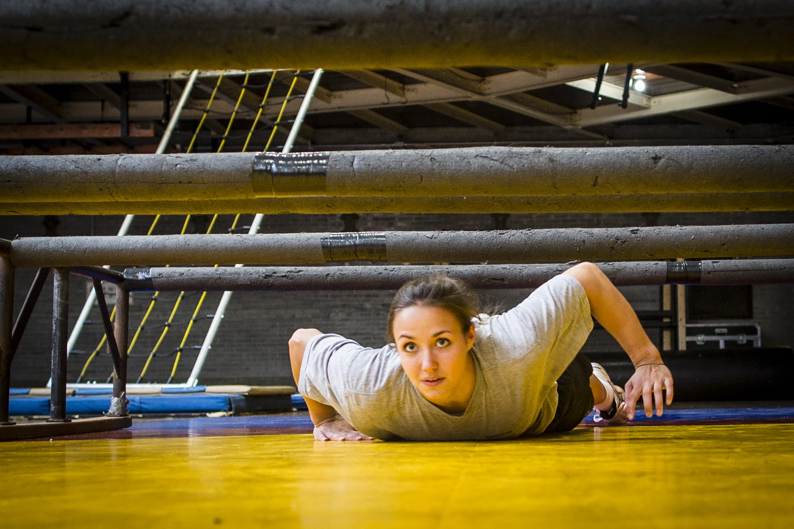
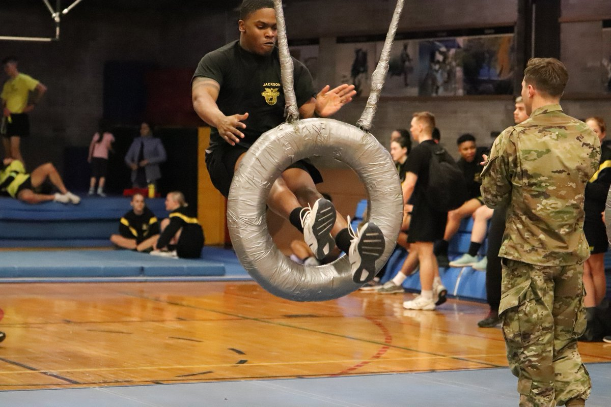

```{r setup, include=FALSE}
knitr::opts_chunk$set(echo = FALSE,
                      message = FALSE,
                      warning = FALSE)
library(tidyverse)
library(knitr)
library(broom)
```

\underline{Title}: The Indoor Obstacle Course Test (IOCT)

\underline{Topics}: Confounding, Causal Diagrams, Simple Linear Regression, Confidence Intervals

\underline{Background}: Cadets at West Point must pass the [Indoor Obstacle Course Test](https://www.youtube.com/watch?v=94tPO0fGtJo&t=77s) (IOCT) to graduate.  The IOCT begins with a series of floor and climbing obstacles and ends with several laps around an indoor track.  It is an exhausting test of endurance and strength. In addition to being a graduation requirement, cadets receive a letter grade that is factored into their class rank.

{width=50%} {width=50%}

Shorter cadets often argue they are at a disadvantage on the obstacle course.  Many obstacles appear to favor taller cadets because they are easier to reach.  In this study, we will investigate the effect of height on IOCT times.

1. [Watch the video of Cadet Madaline Kenyon running the IOCT](https://www.youtube.com/watch?v=94tPO0fGtJo&t=77s). In your opinion, do some obstacles favor taller cadets? Explain.

\vspace{1in} 

The file \texttt{obstacle\_course.csv} contains height (inches), IOCT times (seconds), biological sex (M/F), and whether the cadet played an intercollegiate sport for a sample of 384 cadets who ran the IOCT course in the last five years.  

2. What is the explanatory variable in this study? Classify the variable as quantitative or categorical.

\vspace{0.25in}

3. What is the response variable in this study? Classify the variable as quantitative or categorical.

\vspace{0.25in}

4. Is this study an observational study or a randomized experiment? Explain.

\vspace{1in}

\newpage

Figure 1 depicts IOCT times in seconds versus height in inches.  Table 1 contains information from the linear regression model.

```{r, fig.cap = "Indoor Obstacle Course Test (IOCT) times versus height (n = 384)", fig.height=3.5}
cadets <- read_csv(file = "obstacle_course.csv")

cadets %>% 
  filter(IOCT_Time < 400) %>% 
  ggplot(aes(x = height, y = IOCT_Time)) +
  geom_point() +
  geom_smooth(method = "lm", se = FALSE) +
  ylim(0,400) +
  theme_bw() +
  labs(y = "IOCT time (sec)", x = "height (in)")

cadets %>% 
  filter(IOCT_Time < 400) %>%
  lm(IOCT_Time ~ height, data = .) %>% 
  tidy() %>% 
  kable(digits = 2, caption = "Linear regression output for IOCT times and height.")
```

5. Interpret the estimate of the height coefficient in Table 1. 

    \vspace{1in}

6. Calculate and interpret a 95\% confidence interval for the slope coefficient.

\vspace{1in}

\newpage

7. The $p$-value for height in Table 1 indicates there is strong evidence of an association between height and IOCT time.  Taller cadets tend to do better on the IOCT.   Some people would say the result is *statistically significant*.  However, statistical significance and practical signifigance are different.  [Review the grade scale for the IOCT.](https://en.wikipedia.org/wiki/Indoor_Obstacle_Course_Test)  In your opinion, does the observed association have practical significance? Explain.

\vspace{1in}

8. A shorter cadet argues Figure 1 shows evidence the IOCT is unfair based on height.  Do you agree or disagree? Explain.

\vspace{1in}

9. Briefly explain the difference between these two conclusions.

* *Height is associated with faster IOCT times.*

* *Height causes faster IOCT times.*

\vspace{1in}

10.  Based on the analysis presented thus far, is it possible to distinguish between these two explanations? Explain.

\vspace{1in}

11. Draw a causal diagram depicting the relationship between height, IOCT time, and sex.  Explain your decisions to include/exclude arrows in the diagram.

\vspace{1in}

12. Based on your diagram, identify the confounding variable.

\vspace{0.5in}

Below are boxplots of height in inches and IOCT times in seconds by sex.

```{r, fig.cap="Height (inches) and IOCT time (seconds) by sex.", fig.height=3}
cadets %>%
  filter(IOCT_Time < 400) %>%
  pivot_longer(cols = c(-sex,-athlete),
               names_to = "variable",
               values_to = "value") %>% 
  ggplot(aes(x = sex, y = value)) +
  geom_boxplot() +
  facet_wrap(~variable, scale = "free_y") +
  labs(y = "", x = "")
```

13. Based on Figure 2, is the estimate of the effect of height on IOCT time in Table 1 confounded by sex? If so, is the effect of height smaller or larger than that reported in Table 1? Explain.

\vspace{1in}

\newpage

Figure 3 depicts the association between IOCT time and height by sex. Tables 2 and 3 depict regression results for female and male cadets, respectively.

```{r,fig.cap="Indoor Obstacle Course Test (IOCT) times versus height by sex (n = 384).", fig.height=3}
cadets %>%
  filter(IOCT_Time < 400) %>%
  ggplot(aes(x = height, y = IOCT_Time, color = sex)) +
  geom_point() +
  geom_smooth(method = "lm", se = FALSE) +
  labs(y = "IOCT time (sec)", x = "height (in)")
```

```{r}
cadets %>%
  filter(IOCT_Time < 400, sex == "F") %>%
  lm(IOCT_Time ~ height, data = .) %>% 
  tidy() %>% 
  kable(digits = 2, caption = "Regression results for female cadets.")

cadets %>%
  filter(IOCT_Time < 400, sex == "M") %>%
  lm(IOCT_Time ~ height, data = .) %>% 
  tidy() %>% 
  kable(digits = 2, caption = "Regression results for male cadets.")
```

14. Based on Figure 3 and Tables 2 and 3, does it appear there is an association between IOCT time and height within levels of sex? Explain.

\vspace{1in}

\newpage

15. In your opinion, is there much evidence that height is an advantage on the IOCT (in other words, is height the *cause* of better IOCT times)?  Explain.

\vspace{2in}

16.  Briefly discuss two ways you could improve this study to better assess whether there is a height advantage.

\vspace{1in}

