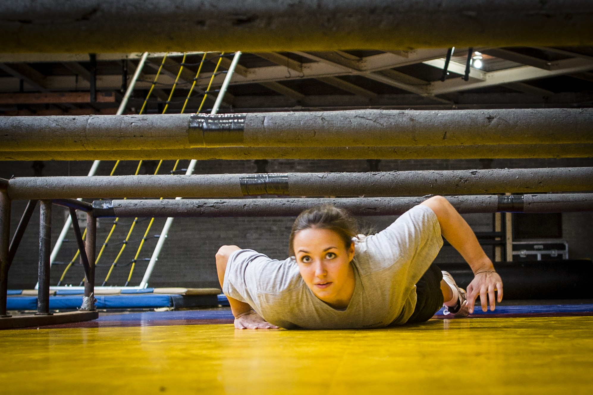

```{r setup, include=FALSE}
knitr::opts_chunk$set(echo = FALSE,
                      message = FALSE,
                      warning = FALSE)
library(tidyverse)
library(knitr)
library(broom)
```

\underline{Title}: Intercollegiate Athletes and the Indoor Obstacle Course Test (IOCT)

\underline{Topics}: Confounding, Causal Diagrams, Two Sample $t$-test, Confidence Intervals

\underline{Background}: Cadets at West Point must pass the [Indoor Obstacle Course Test](https://www.youtube.com/watch?v=94tPO0fGtJo&t=77s) (IOCT) to graduate.  The IOCT begins with a series of floor and climbing obstacles and ends with several laps around an indoor track.  It is an exhausting test of endurance and strength. In addition to being a graduation requirement, cadets receive a letter grade that is factored into their class rank.

{width=50%} {width=50%}

Many cadets play an intercollegiate sport.  An important question is: *is being an intercollegiate athlete an advantage or a disadvantage on the obstacle course?*  Some argue it is an advantage: athletes have more time dedicated to physical conditioning.  Others argue it is a disadvantage: balancing academic and military requirements with their team's schedule is challenging and results in less opportunity to practice the obstacle course.      

1. [Watch the video of Cadet Madaline Kenyon running the IOCT](https://www.youtube.com/watch?v=94tPO0fGtJo&t=77s). Would you expect athletes or non-athletes to perform better on the obstacle course as a group? Explain.

\vspace{1in} 

The file \texttt{obstacle\_course.csv} contains height (inches), IOCT times (seconds), biological sex (M/F), and whether the cadet played an intercollegiate sport for a sample of 384 cadets who ran the IOCT course in the last five years.  

2. What is the explanatory variable in this study? Classify the variable as quantitative or categorical.

\vspace{0.25in}

3. What is the response variable in this study? Classify the variable as quantitative or categorical.

\vspace{0.25in}

4. Is this study an observational study or a randomized experiment? Explain.

\vspace{1in}

\newpage

Figure 1 depicts IOCT times in seconds versus athlete status for cadets with IOCT times less than seven minutes (420 seconds).   Table 1 contains summary statistics. 

```{r, fig.cap = "Indoor Obstacle Course Test (IOCT) times versus intercollegiate athlete status (n = 384)", fig.height=3.5}

cadets <- read_csv(file = "obstacle_course.csv")

cadets %>% 
  filter(IOCT_Time < 420) %>% 
  ggplot(aes(x = as.factor(athlete), y = IOCT_Time)) +
  geom_boxplot() +
  labs(y = "IOCT time (sec)", x = "athlete (1/0)")
```

```{r}
cadets %>% 
  filter(IOCT_Time < 420) %>% 
  group_by(athlete) %>% 
  summarize(mean = mean(IOCT_Time),
            sd = sd(IOCT_Time),
            n = n()) %>% 
  kable(digits = 2, caption = "Summary statistics of IOCT times (seconds) by intercollegiate athlete status.")
```

5. Briefly discuss one interesting result in the boxplot and one in the summary statistics.

\vspace{1.25in}

6. Report the difference in mean IOCT times comparing athletes to non-athletes.  This difference is a point estimate of the size of the *association* between athlete and IOCT time.

\vspace{1in}

7. Calculate a 95\% confidence interval for the difference.

\vspace{1in}

8. There is no evidence of an *association* between athlete and IOCT time.  Would you be willing to conclude there is no *effect* of athlete on IOCT times? As part of your answer, discuss the difference between association and causation in the context of this scenario.

\vspace{2in}

9.  Biological sex may be a confounding variable in estimating the effect of athlete on IOCT time.  Discuss why.

\vspace{2in}

10. Draw a causal diagram depicting the relationship between athlete, IOCT time, and sex.

\vspace{2in}

Tables 2 and 3 contain information about the association between (1) sex and athlete and (2) sex and IOCT time. 

```{r}
cadets %>% 
  filter(IOCT_Time < 420) %>% 
  count(sex, athlete) %>% 
  pivot_wider(id_cols = athlete, names_from = sex, values_from = n) %>% 
  kable(caption = "Athlete status by cadet sex.")

cadets %>% 
  filter(IOCT_Time < 420) %>% 
  group_by(sex) %>% 
  summarize(mean = mean(IOCT_Time),
            sd = sd(IOCT_Time),
            n = n()) %>% 
  kable(digits = 2, caption = "Summary statistics of IOCT times (seconds) by sex.")
```

11. Based on Tables 2 and 3, is the association between athlete and IOCT time likely a biased estimate of the effect due to confounding by sex?  If yes, in what direction is the bias? Explain.

\vspace{2in}

```{r, fig.height=3.5, fig.cap="IOCT times (seconds) by athlete status and sex."}
cadets %>% 
  filter(IOCT_Time < 420) %>% 
  ggplot(aes(x = sex, y = IOCT_Time, color = as.factor(athlete))) +
  geom_boxplot() +
  labs(y = "IOCT time (sec)", color = "athlete")
```

12. Figure 2 depicts IOCT times by sex and athlete status.  Based on this figure, does there appear to be an association between athlete and IOCT times within levels of sex? Explain.

\vspace{1in}

13. Sex is one of many potential confounding variables.  Briefly discuss two additional confounding variables you would want to measure.  As part of your response, clearly state why you believe each variable is a confounding variable.

\vspace{1in}

14.  Design a study to better assess the effect of athlete on IOCT times at West Point.  Write two to three paragraphs describing the study and comparing its advantages and disadvantages to the analysis in this activity.


