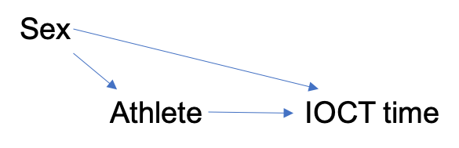

```{r setup, include=FALSE}
knitr::opts_chunk$set(echo = FALSE,
                      message = FALSE,
                      warning = FALSE)
library(tidyverse)
library(knitr)
library(broom)
```

\underline{Title}: Intercollegiate Athletes and the Indoor Obstacle Course Test (IOCT)

\underline{Topics}: Confounding, Causal Diagrams, Two Sample $t$-test, Confidence Intervals

\underline{Background}: Cadets at West Point must pass the [Indoor Obstacle Course Test](https://www.youtube.com/watch?v=94tPO0fGtJo&t=77s) (IOCT) to graduate.  The IOCT begins with a series of floor and climbing obstacles and ends with several laps around an indoor track.  It is an exhausting test of endurance and strength. In addition to being a graduation requirement, cadets receive a letter grade that is factored into their class rank.

{width=50%} {width=50%}

Many cadets play an intercollegiate sport.  An important question is: *is being an intercollegiate athlete an advantage or a disadvantage on the obstacle course?*  Some argue it is an advantage: athletes have more time dedicated to physical conditioning.  Others argue it is a disadvantage: balancing academic and military requirements with their team's schedule is challenging and results in less opportunity to practice the obstacle course.      

1. [Watch the video of Cadet Madaline Kenyon running the IOCT](https://www.youtube.com/watch?v=94tPO0fGtJo&t=77s). Would you expect athletes or non-athletes to perform better on the obstacle course as a group? Explain.

\color{blue}
I would expect the athletes to perform better because they were recruited to West Point to play sports.  In general, they are probably more physically fit due to activities related to their sport before and during their time at West Point.
\color{black}

The file \texttt{obstacle\_course.csv} contains height (inches), IOCT times (seconds), biological sex (M/F), and whether the cadet played an intercollegiate sport for a sample of 384 cadets who ran the IOCT course in the last five years.  

2. What is the explanatory variable in this study? Classify the variable as quantitative or categorical.

\color{blue}
The explanatory variable is intercollegiate athlete (yes/no).  It is a categorical variable.
\color{black}

3. What is the response variable in this study? Classify the variable as quantitative or categorical.

\color{blue}
The response variable in this study is IOCT time in seconds.  It is a quantitative variable.
\color{black}

4. Is this study an observational study or a randomized experiment? Explain.

\color{blue}
This is an observational study because we did not intervene to assign individuals to be athletes or not athletes.
\color{black}


Figure 1 depicts IOCT times in seconds versus athlete status for cadets with IOCT times less than seven minutes (420 seconds).   Table 1 contains summary statistics. 

```{r, fig.cap = "Indoor Obstacle Course Test (IOCT) times versus intercollegiate athlete status (n = 384)", fig.height=3.5}

cadets <- read_csv(file = "obstacle_course.csv")

cadets %>% 
  filter(IOCT_Time < 420) %>% 
  ggplot(aes(x = as.factor(athlete), y = IOCT_Time)) +
  geom_boxplot() +
  labs(y = "IOCT time (sec)", x = "athlete (1/0)")
```

```{r}
cadets %>% 
  filter(IOCT_Time < 420) %>% 
  group_by(athlete) %>% 
  summarize(mean = mean(IOCT_Time),
            sd = sd(IOCT_Time),
            n = n()) %>% 
  kable(digits = 2, caption = "Summary statistics of IOCT times (seconds) by intercollegiate athlete status.")
```

5. Briefly discuss one interesting result in the boxplot and one in the summary statistics.

\color{blue}
Interestingly, the two groups performed about the same (on average) on the obstacle course.  The distributions of times for both groups are positively skewed by many slower times.
\color{black}

6. Report the difference in mean IOCT times comparing athletes to non-athletes.  This difference is a point estimate of the size of the *association* between athlete and IOCT time.

\color{blue}
The difference in mean times is $201.69 - 200.83 = 0.86$ seconds.
\color{black}

7. Calculate a 95\% confidence interval for the difference.

```{r}
library(rstatix)
cadets %>% 
  filter(IOCT_Time < 420) %>% 
  t_test(IOCT_Time ~ athlete, detailed = TRUE) %>% 
  select(conf.low, conf.high) %>% 
  rename(lower95 = conf.low,
         upper95 = conf.high) %>% 
  kable(digits = 3)
```

8. There is no evidence of an *association* between athlete and IOCT time.  Would you be willing to conclude there is no *effect* of athlete on IOCT times? As part of your answer, discuss the difference between association and causation in the context of this scenario.

\color{blue}
We should not conclude that there is no effect of athlete on IOCT time just because we do not see an association.  An association means there is a difference in time between the athletes and non-athletes that we observed.  Causation means there would be a difference between the same individuals if we could observe them as both athletes and non-athletes.  In this case, the athletes may be fundamentally different from non-athletes in ways that are important to IOCT time.  
\color{black}


9.  Biological sex may be a confounding variable in estimating the effect of athlete on IOCT time.  Discuss why.

\color{blue}
Sex will be a confounding variable if athletes are predominately male or female and if IOCT times vary by sex.
\color{black}

10. Draw a causal diagram depicting the relationship between athlete, IOCT time, and sex.



Tables 2 and 3 contain information about the association between (1) sex and athlete and (2) sex and IOCT time. 

```{r}
cadets %>% 
  filter(IOCT_Time < 420) %>% 
  count(sex, athlete) %>% 
  pivot_wider(id_cols = athlete, names_from = sex, values_from = n) %>% 
  kable(caption = "Athlete status by cadet sex.")

cadets %>% 
  filter(IOCT_Time < 420) %>% 
  group_by(sex) %>% 
  summarize(mean = mean(IOCT_Time),
            sd = sd(IOCT_Time),
            n = n()) %>% 
  kable(digits = 2, caption = "Summary statistics of IOCT times (seconds) by sex.")
```

11. Based on Tables 2 and 3, is the association between athlete and IOCT time likely a biased estimate of the effect due to confounding by sex?  If yes, in what direction is the bias? Explain.

\color{blue}
Table 2 indicates that athletes (34.9\%) are more likely to be female than non-athletes (23.7\%).  In addition, Table 3 indicates that male cadets perform better, on average, on the obstable course.  Therefore, we would expect athletes to do better once we adjust for sex.
\color{black}

```{r, fig.height=3.5, fig.cap="IOCT times (seconds) by athlete status and sex."}
cadets %>% 
  filter(IOCT_Time < 420) %>% 
  ggplot(aes(x = sex, y = IOCT_Time, color = as.factor(athlete))) +
  geom_boxplot() +
  labs(y = "IOCT time (sec)", color = "athlete")
```

12. Figure 2 depicts IOCT times by sex and athlete status.  Based on this figure, does there appear to be an association between athlete and IOCT times within levels of sex? Explain.

\color{blue}
For female cadets, athletes did much better than non-athletes.  For males, it appears that there is not much of a difference between athletes and non-athletes, except the athletes did not show many extreme, slow times.
\color{black}

13. Sex is one of many potential confounding variables.  Briefly discuss two additional confounding variables you would want to measure.  As part of your response, clearly state why you believe each variable is a confounding variable.

\color{blue}
If we wanted to assess the effect of being an athlete while at West Point, I would want to adjust for baseline physical fitness when the cadet enters West Point. Doing so would give us a stronger argument for attributing any effect to something that differentiates athletes from non-athletes while at West Point.  In addition, I would collect information on body composition such as BMI.  It is likely athletes and non-athletes are different in terms of BMI, and that BMI is an important cause of IOCT times. 
\color{black}

14.  Design a study to better assess the effect of athlete on IOCT times at West Point.  Write two to three paragraphs describing the study and comparing its advantages and disadvantages to the analysis in this activity.

\color{blue}
One approach is to administer the IOCT to all cadets when they first enter West Point.  At that time, we'll record baseline characteristics: IOCT time, height, weight, sex, and athlete status.  Then, we administer the test again three years later and record their time.  We match each athlete with a non-athlete with similar baseline characteristics and compare the mean times of the two groups.  The advantage of this study is that we have information on baseline physical fitness and body composition.  Using this information, we can reduce confounding by these variables and better isolate the effect of being an athlete.  The main disadvantage to this approach is it increases the administrative burden on conducting the study...we have to give the test twice to each cadet instead of once.
\color{black}
