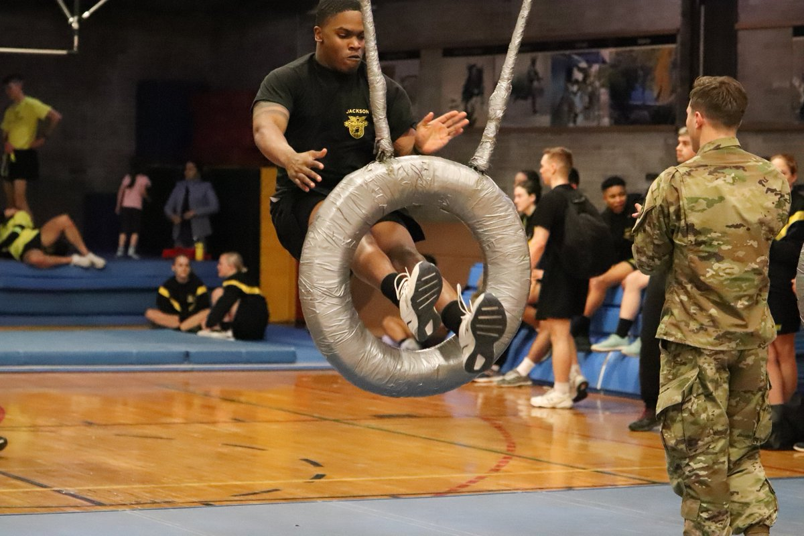

```{r setup, include=FALSE}
knitr::opts_chunk$set(echo = FALSE,
                      message = FALSE,
                      warning = FALSE)
library(tidyverse)
library(knitr)
library(broom)
```

\underline{Title}: The Indoor Obstacle Course Test (IOCT)

\underline{Topics}: Confounding, Causal Diagrams, Simple Linear Regression, Confidence Intervals

\underline{Background}: Cadets at West Point must pass the [Indoor Obstacle Course Test](https://www.youtube.com/watch?v=94tPO0fGtJo&t=77s) (IOCT) to graduate.  The IOCT begins with a series of floor and climbing obstacles and ends with several laps around an indoor track.  It is an exhausting test of endurance and strength. In addition to being a graduation requirement, cadets receive a letter grade that is factored into their class rank.

{width=50%} {width=50%}

Shorter cadets often argue they are at a disadvantage on the obstacle course.  Many obstacles appear to favor taller cadets because they are easier to reach.  In this study, we will investigate the effect of height on IOCT times.

1. [Watch the video of Cadet Madaline Kenyon running the IOCT](https://www.youtube.com/watch?v=94tPO0fGtJo&t=77s). In your opinion, do some obstacles favor taller cadets? Explain.

\color{blue}
Height seems to be an advantage on some obstacles.  For example, one obstacle requires the cadets to pull themselves onto a platform over their head.  In addition, rope climbing may be quicker for taller people because they require fewer locks.
\color{black}

The file \texttt{obstacle\_course.csv} contains height (inches), IOCT times (seconds), biological sex (M/F), and whether the cadet played an intercollegiate sport for a sample of 384 cadets who ran the IOCT course in the last five years.  

2. What is the explanatory variable in this study? Classify the variable as quantitative or categorical.

\color{blue}
The explanatory variable in this study is height.  It is quantitative.
\color{black}


3. What is the response variable in this study? Classify the variable as quantitative or categorical.

\color{blue}
The response variable in this study is IOCT time.  It is also quantitative.
\color{black}

4. Is this study an observational study or a randomized experiment? Explain.

\color{blue}
This is an observational study because the researchers did not intervene on the assignment of the explanatory variable (height) to the subjects in the study.
\color{black}

Figure 1 depicts IOCT times in seconds versus height in inches.  Table 1 contains information from the linear regression model.

```{r, fig.cap = "Indoor Obstacle Course Test (IOCT) times versus height (n = 384)", fig.height=3.5}
cadets <- read_csv(file = "obstacle_course.csv")

cadets %>% 
  filter(IOCT_Time < 400) %>% 
  ggplot(aes(x = height, y = IOCT_Time)) +
  geom_point() +
  geom_smooth(method = "lm", se = FALSE) +
  ylim(0,400) +
  theme_bw() +
  labs(y = "IOCT time (sec)", x = "height (in)")

cadets %>% 
  filter(IOCT_Time < 400) %>%
  lm(IOCT_Time ~ height, data = .) %>% 
  tidy() %>% 
  kable(digits = 2, caption = "Linear regression output for IOCT times and height.")
```

5. Interpret the estimate of the height coefficient in Table 1. 

\color{blue}
The average IOCT time decreases by about six seconds for each one inch increase in cadet height.  In other words, taller cadets tend to do better than shorter cadets by about six seconds per inch of height.
\color{black}


6. Calculate and interpret a 95\% confidence interval for the slope coefficient.

```{r}
cadets %>% 
  filter(IOCT_Time < 400) %>%
  lm(IOCT_Time ~ height, data = .) %>% 
  tidy(conf.int = TRUE) %>% 
  filter(term == "height") %>% 
  select(conf.low, conf.high) 
```

\newpage

7. The $p$-value for height in Table 1 indicates there is strong evidence of an association between height and IOCT time.  Taller cadets tend to do better on the IOCT.   Some people would say the result is *statistically significant*.  However, statistical significance and practical signifigance are different.  [Review the grade scale for the IOCT.](https://en.wikipedia.org/wiki/Indoor_Obstacle_Course_Test)  In your opinion, does the observed association have practical significance? Explain.

\color{blue}
Letter grades are assigned for about 5-10 second intervals of time.  For example, 2:45 to 2:49 is a B- and 2:50 to 2:54 is a C+.  A six second difference in average IOCT time for each inch of height would have practical importance...that is about a half a letter grade for each inch of height. 
\color{black}

8. A shorter cadet argues Figure 1 shows evidence the IOCT is unfair based on height.  Do you agree or disagree? Explain.

\color{blue}
While Figure 1 shows a strong association between height and IOCT time, we do not know if the taller cadets are different from the shorter cadets in ways that are important causes of faster IOCT times.  Therefore, we can say there is an association between IOCT times and height but we do not know if height is the cause of the faster IOCT times.
\color{black}

9. Briefly explain the difference between these two conclusions.

* *Height is associated with faster IOCT times.*

* *Height causes faster IOCT times.*

\color{blue}
Two variables are associated if they frequently change together when we observe them.  In other words, association is about what we \underline{see}.  Association can occur when one variable causes another or when two variables share a common cause.  In this case, height is associated with IOCT times if it is the cause of the faster times or if there is another variable that itself is a cause of both height and IOCT times.

One variable is a cause of a second variable if there is a change (on average) in the second variable when we intervene on the first variable.  In other words, causation is about what happens when we \underline{do} something (Pearl, 2018).  Height is a cause of faster IOCT times if intervening on only cadet heights results in different IOCT times on average.
\color{black}

10.  Based on the analysis presented thus far, is it possible to distinguish between these two explanations? Explain.

\color{blue}
No, based only on Figure 1 and Table 1, we cannot determine if the relaitonship between height and IOCT times is one of correlation or causation.  Both explanations are consistent with the results thus far.
\color{black}

\newpage

11. Draw a causal diagram depicting the relationship between height, IOCT time, and sex.  Explain your decisions to include/exclude arrows in the diagram.

{width=50%}

\color{blue}
I included an arrow between sex and height because male cadets are taller, on average, than female cadets. I included an arrow between sex and obstacle course time because there is likely a difference in performance (on average) on the obstacle course between males and females.
\color{black}

12. Based on your diagram, identify the confounding variable.

\color{blue}
The confounding variable is sex.
\color{black}

Below are boxplots of height in inches and IOCT times in seconds by sex.

```{r, fig.cap="Height (inches) and IOCT time (seconds) by sex.", fig.height=3}
cadets %>%
  filter(IOCT_Time < 400) %>%
  pivot_longer(cols = c(-sex,-athlete),
               names_to = "variable",
               values_to = "value") %>% 
  ggplot(aes(x = sex, y = value)) +
  geom_boxplot() +
  facet_wrap(~variable, scale = "free_y") +
  labs(y = "", x = "")
```

13. Based on Figure 2, is the estimate of the effect of height on IOCT time in Table 1 confounded by sex? If so, is the effect of height smaller or larger than that reported in Table 1? Explain.

\color{blue}
Yes, the estimate is likely confounded.  The data shows a strong relationship between height and sex and IOCT time and sex.  In this case, it appears that male cadets tend to be taller and run the obstacle course faster.  Therefore, the actual effect of height on IOCT time is probably smaller.
\color{black}

Figure 3 depicts the association between IOCT time and height by sex. Tables 2 and 3 depict regression results for female and male cadets, respectively.

```{r,fig.cap="Indoor Obstacle Course Test (IOCT) times versus height by sex (n = 384).", fig.height=3}
cadets %>%
  filter(IOCT_Time < 400) %>%
  ggplot(aes(y = IOCT_Time, x = height, color = sex)) +
  geom_point() +
  geom_smooth(method = "lm", se = FALSE) +
  labs(y = "IOCT time (sec)", x = "height (in)")
```

```{r}
cadets %>%
  filter(IOCT_Time < 400, sex == "F") %>%
  lm(IOCT_Time ~ height, data = .) %>% 
  tidy() %>% 
  kable(digits = 2, caption = "Regression results for female cadets.")

cadets %>%
  filter(IOCT_Time < 400, sex == "M") %>%
  lm(IOCT_Time ~ height, data = .) %>% 
  tidy() %>% 
  kable(digits = 2, caption = "Regression results for male cadets.")
```

14. Based on Figure 3 and Tables 2 and 3, does it appear there is an association between IOCT time and height within levels of sex? Explain.

\color{blue}
There does not appear to be an association between height and IOCT times within levels of sex.  The regression slopes in the figure and tables are very close to zero.
\color{black}

15. In your opinion, is there much evidence that height is an advantage on the IOCT (in other words, is height the *cause* of better IOCT times)?  Explain.

\color{blue}
Based upon the stratified analysis, it does not appear that there is much of an advantage of height.  The most plausible explanation is the observed association between height and IOCT was due to confounding by sex.  If there was an effect of height, we would expect to see it within levels of sex.
\color{black}

16.  Briefly discuss two ways you could improve this study to better assess whether there is a height advantage.

\color{blue}
* Instead of stratifying on sex, we could use multiple regression to obtain sex-adjusted estimates of the effect of height.

* We should consider other potential confounding variables.  For example, intercollegiate athletes may be overrepresented in different height ranges.

* If we could recollect the data, we could match taller cadets to shorter cadets with similar levels of confounding variables.  

\color{black}

